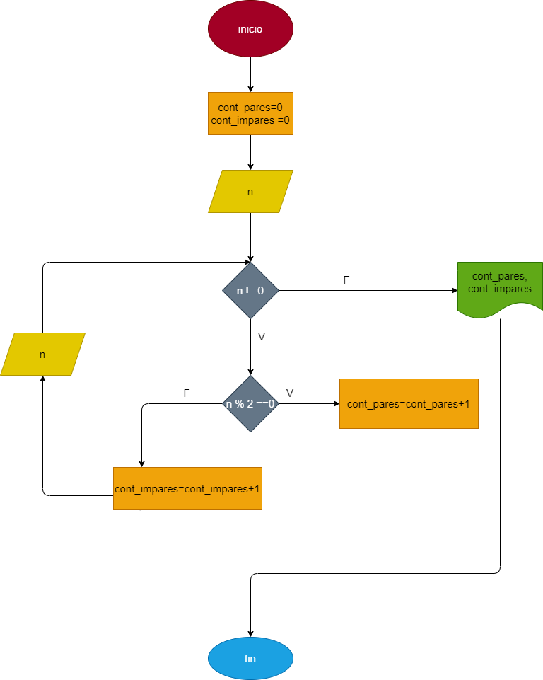

# Cuenta_pares_impares

# Hacer el diagrama de flujo y el programa en python que lea numeros enteros y positivos (uno) en cada lectura y que averigue e imprima cuantos son pares y cuantos son impares.
# Para terminar utilizaremos el registro centinela cuado el valor del numero leido sea cero 

## Diagrama de flujo 